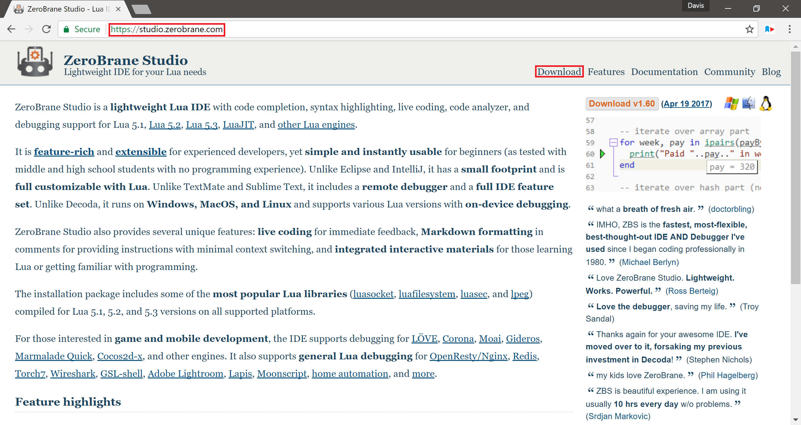
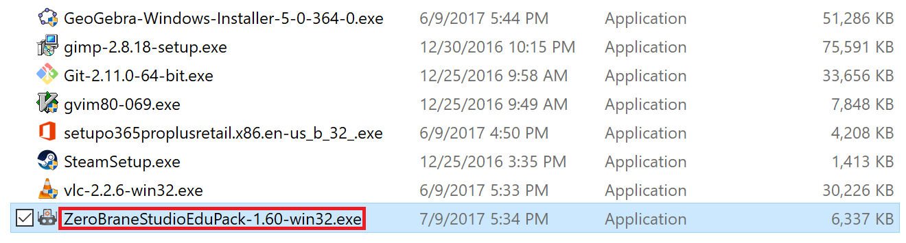
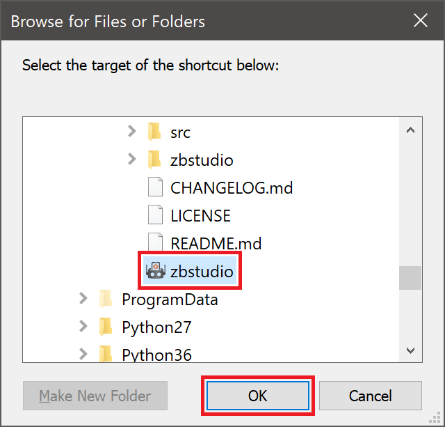

# An Introduction to Lua

## Introduction

### Purpose

The purpose of this guide is to take a person who knows little/nothing about
programming and to teach them Lua (version 5.2, though all versions numbered
with a '5' as the first number should be very similar). By the end of the
tutorial, the reader should be able to read and write Lua with general ease.

### Why Lua?

You may be wondering: "Why should I learn Lua?" There are several features of
Lua that make it ideal as a first language:

- Lua is a small language. This means that it has very few built-in commands.
  While this may not seem like an advantage at first, there are a few reasons
  why this is beneficial:

	- It makes the language easier to learn.
	- It reinforces concepts. Because many aspects that other languages
	  have are not present by default in Lua, you gain a better
	  understanding of how the concept works by implementing it yourself.

- Lua is more forgiving than many languages. Many languages feature complex and
  confusing processes, such as "static typing" and "compiling." These can be
  confusing for first-time users. Because Lua does not feature these concepts,
  there will be at no point a concept where the reader is told to "Just trust
  me" (though I will delay explaining some topics fully until later in order to
  avoid confusion). Throughout this tutorial I will make an effort to explain
  not only how, but also why things are the way they are.

- Installing Lua is very simple and straightforward.

### Installing and Setting up an Editor

In order to edit code, you need something called a **text editor**. An editor
is what you use to write your code. Editors can be as simple or complex as you
would like them to be. You can even use Notepad to edit your Lua files, though
I would **strongly** advise against this for several reasons. Primarily, it
lacks syntax highlighting, which makes your code easier to read. It also lacks
an advanced undo structure, which severely limits your ease-of-use. For most
entry-level users, I recommend installing ZeroBrane, an **IDE**, or
**Integrated Development Environment** for Lua. What does "integrated
development environment" mean? Basically, it makes programming in Lua easier by
aiding in some common tasks. One big advantage is that it comes installed with
several versions of Lua and is very easy to install:

<center></center>

1. Go to [studio.zerobrane.com](https://studio.zerobrane.com)
1. Select the "Download" tab on the right side of the page

	<center></center>

1. Select the option "Take me to the download page this time" for now (unless
   you're feeling generous). This program is available for free, but you can
   find the development now (or at a later date if you desire).

	<center></center>

1. Select "Windows 32bit (exe installer)"


	<center></center>

1. If you get the option to choose where the installer is downloaded, put it
   in your "Downloads" directory
1. Once you've selected the directory, click "Save"

	<center></center>

1. Now you need to figure out if your computer is 32 or 64 bits. If you're not
   sure, open the File Explorer and go to `C:\`. This will be found either
   under `This PC` or `My Computer` depending on the age of your computer. If
   you have a directory called `Program Files (x86)`, as pictured here, you are
   using a 64 bit computer; if not, you're using a 32 bit computer.

	<center></center>

1. Now, run the installer. This can be done by navigating to the directory
   where it was downloaded and double-clicking the installer. It should be
   called something like `ZeroBraneStudioEduPack-1.60-win32.exe`.

	<center></center>

1. When you run the installer, you should be greeted by this pop-up dialog box.
   If you can't read the text, try holding `Ctrl` and moving your mouse wheel.
   Select the text under the heading `Destination folder` so that it appears
   blue, like picture above.

	<center></center>

1. Now you need to choose where the program should be installed. For 64 bit
   systems, install the program in `C:\Program Files (x86)\ZeroBrane` and for
   32 bit systems, install the program in `C:\Program Files\ZeroBrane`. Note
   that the location does not matter that much, it's just good practice to put
   files in these locations so that they are easier to find later on. You will
   probably be asked to grant administrator privileges, in which case, you
   should say yes.

	<center></center>

1. Once the installation is completed, you should be greeted with a screen that
   looks like this. Congratulations! Your installation is complete.

	<center></center>

1. Next you will want to create a shortcut on your desktop so that it is
   easier to run the program. To do this, close or minimize all open windows
   and right-click on the desktop (**not** one of the icons). Move the mouse
   down until you see the "New" option.
1. From the new menu, choose the option "Shortcut" to create the shortcut on
   your desktop.

	<center></center>

1. You should be greeted with a prompt that looks something like the above.
   Select "Browse" to locate the program.

	<center></center>

1. Navigate to the location of the ZeroBrane Studio executable. If you followed
   the steps above, it should be in `C:\Program Files (x86)\ZeroBrane\` or
   `C:\Program Files\ZeroBrane\`. Click on the executable, called `zbstudio`.
   (**Note** that the `C:\` directory is located in either `This PC` or
   `My Computer` depending on the age of your system)
1. Once you have selected the executable, select "OK" to continue.

	<center></center>

1. Once the program has been selected, its path should appear, like so. Choose
   "Next" to continue.

	<center></center>

1. Give a name to the program. The name does not matter, so you can change the
   name if you want. Just make sure that it makes sense. For instance, you
   could change the name from `zbstudio` to `ZeroBrane` if you want. When
   you're done, click "Finish."

	<center> </center>

1. Now you should have a shortcut on your desktop, as you see here. If you
   double-click this icon, you can launch ZeroBrane studio.

- Click on the side-menu "Advanced System Properties"

- Choose "Environment Variables"

- Find the bottom part, labeled "System Variables"

- Click on `Path`, then `Edit`, then `New` and type (or paste) the `"PATH"`
  directory from earlier.

Now, you should be able to type `lua` on your command prompt and see the same
screen you saw before.

### Format of this Guide

Each sections is composed of two parts: **Instruction** and **Exercises**. In
the instruction part, commands are entered through Lua's interactive mode. In
the exercises part, a file is written and run through the command line like so:

```
lua FILENAME
```

Where `FILENAME` is the name of the Lua file you are running. For instance, if
your filename is `test.lua`, the command you would enter (while in the
current directory of the Lua file `test.lua`) would be `lua test.lua`. This
executes the file and shows its output in the command prompt.


## Variables

Variables contain values. These values can be of several types: `strings`,
`numbers`, `booleans` and more. The type of a variable represents how it can
be used and what it is used for. Variables are the building blocks of all good
code and are an extremely important concept to understand.

### Variable Names and Comments

Variables in Lua can be any series of letter or numbers, as long as they don't
start with a number (the reasoning for this will be given later). Variables can
also contain underscores, but no other special characters. This is because most
of these characters are operators, such as addition or subtraction. The
following are all *valid* variable names (note that you should **not** run the
following in the interpreter):

```lua
variable
name123
this_name
luaIsAwesome
```

The following are all **not** valid variable names (you should **not** run this
section either):

```lua
2songName      -- Variables cannot start with numbers
this variable  -- Variables cannot have spaces
lua-is-awesome -- Variables can only have underscores, letters, and numbers
```

You may have noticed the "`--`" above. These are called **single-line** or
**one-line comments**. Anything after these two dashes is ignored by the
interpreter. Comments can be used to document your code. The space after `--`
does not have to be present, though I prefer the way it looks with it.

You can also do **multi-line** or **block comments**, which are like comments,
but span multiple lines. They are opened with "`--[[`" and closed with "`]]`".
Note that with multi-line comments, there must be **no** space between `--` and
`[[`. You can use multi-line comments, for example, to make notes about valid
variable names. Open up the command line and type `lua` to go into interactive
mode and type the following:

```lua
--[[
Valid variable names:
---------------------
variable
name123
this_name
luaIsAwesome

Invalid variable names:
-----------------------
2songName      -- Variables cannot start with numbers
this variable  -- Variables cannot have spaces
lua-is-awesome -- Variables can only have underscores, letters, and numbers
]]
```

Notice how nothing happens when you finish. That is because you aren't doing
anything yet. Remember, comments are ignored by the interpreter, so this is
essentially the same as just hitting enter.

In the above examples, you may have noticed that there are many ways to format
variable names. There are two prevailing ways to separate words:

```lua
variableNamesLikeThis

-- or

variable_names_like_this
```

The first is called `camelCase` and the second is called `snake_case`. In this
tutorial I will use camel case simply because I prefer it, though both methods
are perfectly valid.

Note that capitalization **does** matter: `thisVariable` is different from
`THISVARIABLE` and so on.

Variable names should be short but descriptive. The descriptive part is of more
importance than the short part, however. Your variable name needs to be
descriptive to help you remember the purpose of the variable. When in doubt, go
with verboseness over conciseness. This will save you headaches in the long
run, by keeping you from having to search all over the place for what your
variable represents.

### Assigning and Accessing Variables

You **assign** variables with an equal sign. Assigning a variable just means
that you are giving the variable a value.  Variable assignment looks like this:

```lua
variableName = value
```

**Accessing** variables is done by referencing the name of the variable. For
instance, if you wanted to view the value of a variable, you would do so like
so (enter this into the Lua command line):

```lua
variableName = 5
print( variableName ) -- 5 (You do not need to write comments)
```

The `print` command is used to show the output of values and is part of Lua's
**standard library**. It is called a **function**. A function is something that
will be explained more later, but essentially it is used to make programming
easier.

### Variable Types

In (virtually) all programming languages, variables have what are called
"types." The type of a variable dictates what the variable is used for. There
are several types of variables, but the most common are `numbers` `strings`,
and `booleans`.

#### Numbers

In the above example, `variableName` must conform to the variable naming
specifications (see [Variable Names and Comments](#variable-names-and-comments)
for more) and `value` can be virtually anything. For instance, if you wanted to
assign a variable to the value of pi, you could do:

```lua
pi = 3.14
print( pi ) -- 3.14
```

In this example, the variable assigned is a **number**. As mentioned before,
there are many types of values a variable can store, and each type has
different uses. Numbers, for instance, are used for mathematical operations.

Numbers can be stored in many different formats. For instance, if you wanted to
represent a number in scientific notation, you could do the following:

```lua
speedOfLight = 3e8

-- or

speedOfLight = 3E8

print( speedOfLight ) -- 300000000
```

Numbers can also be stored in hexadecimal with the following notation:

```lua
fourteen = 0xE
fourteen = 0XE
print( fourteen ) -- 14
```

Note that hex numbers **must** be preceded with `0x` or `0X`. This is the
representation used to store hexadecimal numbers, as well as part of the reason
that variable names in Lua cannot be started with numbers, as there would be
ambiguity as to whether you are referencing a number or assigning a variable.

You can also perform operations and store those values as numbers. For
instance:

```lua
pi = 3.14
r = 1
area = pi * r ^ 2
print( area ) -- 3.14
```

Note that numbers are evaluated in the same way that you follow order of
operations, though parenthesis can be used for clarity if desired.

You can also use a variable in its own assignment if it already has a value.
For instance, increasing a number by one is called **incrementing** and
decreasing a variable by one is called **decrementing**. This is done like so:

```lua
numberOfSongs = 3

-- Later, say when a song is added:
numberOfSongs = numberOfSongs + 1
print( numberOfSongs ) -- 4
```

#### Strings

The `string` type is used to store characters. They're called `strings` because
they contain a "string," or series of characters. The name is somewhat
confusing, but their usage isn't.  They're used to store virtually any
information that won't be used as a number or in mathematical operations.
Strings are surrounded by single quotes or double quotes. The following are all
strings:

```lua
state = "North Carolina"
country = 'United States of America'

print( state ) -- North Carolina
print( country ) -- United States of America
```

Note that you must open and close the string with the same type of quote. Both
formats are valid, though I prefer to use single quotes because they're easier
to type, so that is what I will use throughout the tutorial.

It is possible to mix single and double quotes, like so:

```lua
sentence = 'She said "No way Jose!"'
response = "I said \"Yes way Jose!\""

print( sentence ) -- She said "No way Jose!"
print( response ) -- I said "Yes way Jose!"
```

Note the `\"` in the second example. This is called "escaping" and is used to
contain double quotes in a string surrounded by double quotes. Basically, what
these do is tell Lua that these quotes are part of the string and do not
represent the end of the string. Note that, because we used single quotes in
the first example, there was no need to escape the double quotes (though
escaping the double quotes there wouldn't be wrong). Single quotes can also be
escaped.

Just as there are operators you can do on numbers, there are operators you can
use on strings. You can combine strings with the "`..`" operator. This is
called **concatenating** strings. You can concatenate multiple strings at once.

```lua
part1 = 'this'
part2 = 'is'
part3 = 'a'
part4 = 'test'

sentence = part1 .. ' ' .. part2 .. ' ' .. part3 .. ' ' .. part4
print( sentence ) -- this is a test
```

Note that strings can be concatenated even if they are not already assigned to
a variable, as shown in the above demonstration, where the variables have
already been assigned while the spaces (`' '`) have not.

#### Multi-Line Strings

Just as comments can be multiple lines, strings can also be multiple lines. The
syntax for multi-line strings is very similar to multi-line comments. Recall
that multi-line comments look like so:

```lua
--[[
This is a
multi-line comment
]]
```

This is what multi-line strings look like:

```lua
mutliLineString = [[
This text is part of
a multi-line string.

You can use both "double"
and 'single quotes'
without worrying
]]

print( multiLineString )
```

Note that the line after `without worrying` **is** present. To get rid of this
extra line, simply put the `]]` on the same line as `without worrying`. Also
note that the first line after `[[` is ignored.

#### Booleans

If numbers store numbers and strings store strings of characters, what do
booleans store? Booleans store values that represent "thruthiness." Booeleans
have two values: `true` or `false`.

```lua
luaMaster = false
luaLearner = true

print( luaMaster ) -- false
print( luaLearner ) -- true
```

Booleans are useful when dealing in absolutes. For instance, if you had a
variable `carIsRunning`, you would probably use a boolean to represent if the
car is running or not, because the car can either be on or off. A car cannot be
between running and not running; that's not possible. Similarly, something that
a variable represents may only be in two states. Booleans are used to represent
these variables.

#### Nil

Nil is a special type of value in Lua. It is the value used when a variable is
not assigned. For instance, take the example below:

```lua
Index = 1
print( index ) -- nil
```

Note here that the variable assigned is `Index`, while the variable accessed is
`index`. Because these are different variables (remember: capitalization
matters), `index` has not been assigned, so it has no value. So, `nil` is the
value given to variables who have not been assigned.

You may be wondering: Why is this useful? Why can't Lua just figure out what
variable I'm going for instead of being so pedantic? Because you don't want
your programming language to try to "figure out" anything; it should do
**only** what you tell it to. This is because you can get hard to find errors
if the program thinks you're trying to type one thing and you mean another.

Additionally, having the `nil` value is useful for several somewhat complex
reasons. These will be explained more later, but what you need to know now is
that it allows you to check if a variable has been assigned or not.

### The `type` Command

Just like the `print` command is a part of Lua's standard library, so to is
another command: `type`. The `type` command is used to get a variable's type.
For instance, if you ran

```lua
print( type( 3 ) ) -- number
```

You would get `number`. That's because `3` is a number. You can see all the
variable types represented:

```lua
print( type( 'This is a string' ) ) -- string
print( type( true ) ) -- boolean
print( type( nil ) ) -- nil
```

This command is useful for getting information about a variable.

### Why would I want to use variables?

Variables are extremely useful and are the building blocks for a program.
Variables hold many benefits for programmers:

- Variables make  your code easier to read and understand. Variables are more
  descriptive than just numbers or strings. You may not know exactly what
  `d = 6.28 * r` means or does, but you know exactly what it represents in the
  example below:

```lua
pi = 3.14
tau = 2 * pi
radius = 5
diameter = tau * radius
```

- Variables make changing your code easier. For instance, say your program
  gets the area and circumference of a circle. This is what your program looks
  like:

```lua
radius = 3
area = 3.14 * radius ^ 2
circumference = 2 * 3.14 * radius
```

- What happens if you decide you want more precision with your results? You
  would be forced to change every occurrence of `3.14` with whatever the new
  value is. Of course, in this example, that's only two times. But you can
  imagine how much of a pain it would be in an actual program. It's easier to
  use a variable for `pi`, and to just change that one value instead of every
  individual value, avoiding wasted time and frustration.

In summary, variables:

- Make your code easier to read
- Make changes easier and faster

#### Strings vs Numbers

You may have noticed that strings can store numbers. This may have caused you
to ask yourself, "How do I decide if I should use a number or a string?" The
answer is "It depends." For a simple answer, numbers that you will be doing
mathematical calculations with should be `numbers`, while numbers that will
only be stored or displayed should be `strings`. For instance, a phone number
would usually be stored as a `string`, as no calculations will be done with a
phone number. On the other hand, a person's age would probably be stored as a
`number`, as, at the very least, it will need to be incremented.

### Exercises

In this section, you will create a file that should act as your notes. Feel
free to add comments liberally to document what it is you're doing and why. I
recommend making a directory on your `Desktop` called "Lua" or something really
clever like that. Within that directory, make a text document called something
like `01 Variables and Comments.lua`. Next, open the file with Notepad++ and
add the following to the file:

```lua
info1 = 'This is a string'
info2 = 'Strings can store letters and numbers'

print( info1 )
print( info2 )
```

Next, bring a command prompt to that location. To do this:

1. open up a command prompt and type `cd \`. This will set the current
   directory to `C:\`.

1. View the contents of the directory. Type `dir` to view the contents. If you
   didn't know, the location of your Desktop directory is
   `C:\Users\USERNAME\Desktop`, where `USERNAME` is obviously (hopefully) your
   username. So when you type `dir`, you should see `Users` as one of the
   directories. Type `cd Users` to set the current directory to `C:\Users\`.

1. Type in `dir` again to view the users on your system. `cd` into your
   username.

1. Type `dir` again to view the directories in `C:\Users\USERNAME\`. You should
   see a directory called `Desktop`. `cd` into it.

1. Type `dir` to view the contents of your desktop. You should see your `Lua`
   directory there. `cd` into it.

1. Type `dir` one last time. You should see the file you created.

1. Type `lua "01 Variables and Comments.lua"`. Note that the quotes **are**
   required. You can also press `tab` whenever you're typing the name and, if
   the name can be auto-completed, the name will be filled in. For instance, if
   you type `lua 01` and press `tab`, the name should automatically be
   completed, with the proper format.

If you've followed the directions, your command prompt should have the output:

```
This is a string
Strings can store letters and numbers
```

Next, you will want some notes on variable names:

```lua
thisIsCamelCase = true
this_is_snake_case = true

print( thisIsCamelCase )
print( this_is_snake_case )

1invalidName = true
also bad = true
don't-bother = true
```

When you run the file you should see an error that says something like:

```
lua: 01 Variables and Comments.lua:13: unexpected symbol near '1'`
```

Let's break down this error:

- `lua:`: This tells you that the error is a Lua error.

- `01 Variables and Comments.lua`: This is the file in which the error occurs.

- `13:` This tells you the line on which the error occurred. If the line isn't
  exactly 13, don't worry. (In fact, it should probably be past 13 because of
  all the comments you've added!)

- `unexpected symbol near '1'`: This tells you that there is something that was
  not expected near `1`. If you remember from earlier, variable names in Lua
  cannot start with numbers. To get rid of this error, change that line to
  something like this:

```lua
-- 1invalidName = false
-- Variable names can't start with numbers!
```

When you run the file again, you should get another error:

```
lua: test.lua:14: syntax error near 'bad'
```

This time, the syntax error is near `bad`. This is because variables in Lua
cannot have spaces! The Lua interpreter is expecting something after the space,
such as a comma or equal-sign. To get rid of this, comment out the line and
add some notes.

When you run the file again, you should get yet another error:

```
lua: test.lua:15: unfinished string near ''t-bother = true'
```

This is because the `'` indicates the start of a string. In Lua, strings can't
be multiple lines. (Actually, they can, but you need to use special characters
to indicate this). At any rate, the string isn't enclosed, so the error is
still valid. Get rid of the quote to get rid of that error message, and add a
comment noting so. Now, you're greeted with a new error:

```
lua: test.lua:15: syntax error near '-'
```

This is because you can't have dashes within a variable name. Comment out the
line to get rid of the error.

Now add the following:

```lua
booleanVariable = true
stringVariable = 'string'
numberVariable = 123
multiLineString = [[
This is a
string that spans
mutliple lines
]]

--[[
This comment also
spans mutliple lines
]]

print( booleanVariable )
print( stringVariable )
print( numberVariable )
print( multiLineString )
print( thisVariableIsNil )
```

**Remember**: This is supposed to serve as *your* notes. Add more if you think
it's necessary. (You should have **much** more than I have here).


## Basic Loops

Sometimes when you are programming, there will be a task that is repeated many
times. For instance, say you want to print your name five times.  You could
write something that looks like this:

```lua
name = 'John Smith'

print( name )
print( name )
print( name )
print( name )
print( name )
```

As a programmer, you should strive to be as lazy when typing as possible. This
means that the above code is a big no-no. The main reason for this is that it
is difficult to change. Say, for instance, you want to print your name 10
times. That means copying and pasting everything. (***Hopefully*** you didn't
consider typing all of that!) This is unwieldy, but manageable. But what
happens if you want to print your name ***100*** times? This would be a real
pain to type and would be ridiculous. But what about a **variable** number of
times? This would be impossible with what you currently know.  Thankfully, Lua
includes a construct that is ideal for this type of situation: the `for-loop`.

### Numeric For-Loops

Instead of writing everything multiple times, you can use what are called
**numeric for-loops**. The name might be scary, but all it does is do something
a certain amount of times.  This is the basic structure of this loop is (you
should **not** run this):

```lua
for VAR = START, END, INCREMENT do
	-- Code
end
```

In the above code, `VAR` is a variable that represents the current index of the
loop. `START` represents the number at which the loop begins, `END` represents
the number at which the loop stops, and `INCREMENT` is the amount by which to
increase (or decrease) `VAR` at the end of each loop. If `INCREMENT` is not
given, it defaults to `1`.

Below is a basic example of a for-loop:

```lua
for index = 1, 5, 1 do
	print( index )
end

--[[
1
2
3
4
5
]]
```

Note that, because the increment is `1` by default, this loop is the same as

```lua
for index = 1, 5 do
	print( index )
end
```

With most cases, you will want to increment by one, but you can increment by
any real number. For instance, if you wanted even numbers, you could do:

```lua
for i = 2, 10, 2 do
	print( i )
end

--[[
2
4
6
8
10
]]
```

You can also use a variable as the `STOP` or increment. For instance, in the
above example, where you wanted to print your name a certain amount of times,
you would do something like this, changing `times` to the number of times you
would like to print the person's name.

```lua
name = 'John Smith'
times = 100

for index = 1, times do
	print( name )
end
```

This is **much** better than typing that and changing it all the time.

#### Using the Stop and Increment Controllers

You may remember the parts of the for-loop labeled `STOP` and `INCREMENT` from
before. These two variables work in conjunction with each-other to control how
much the for-loop loops. The loop will continue until the index will surpass
`STOP`. Here are some examples of how different loops work:

```lua
for i = 1, 8, 2 do
	print( i )
end
--[[
1
3
5
7
]]

for i = 8, 1, -2 do
	print( i )
end
--[[
8
6
4
2
]]
```

Note that in each of the above examples, if the loop would have executed one
more time, the index would have surpassed `STOP`.

### While-Loops

While loops rely on [booleans](#booleans) to control their flow. A while-loop
executes **while** the condition is true. For instance, if you wanted to
implement a simple incrementing for-loop, you would do something like this:

```lua
index = 1
while index < 5 do
	print( index )
	index = index + 1
end

--[[
1
2
3
4
]]
```

A look at how the loop works helps to understand why it prints 1-4 and not 5.
This is what the loop looks like at each step of execution (do **not** run the
following code; it is simply an illustration of what is occurring):

```
Is 1 < 5? Yes, so:
	print( 1 )
	index = 1 + 1 -- (index now is equal to 2)
	Check condition again

Is 2 < 5? Yes, so:
	print( 2 )
	index = 2 + 1 -- (index = 3)
	Check condition again

Is 3 < 5? Yes, so:
	print( 3 )
	index = 3 + 1
	Check condition again

Is 4 < 5? Yes, so:
	print( 4 )
	index = 4 + 1
	Check condition again

Is 5 < 5? No, so stop.
```

Now it is obvious why 5 is not output: The loop only executes while the given
condition is `true`, then quits.

Note that it is **essential** to assign the variable *before* the while-loop.
The concept is a bit complicated, but essentially, you can't compare `index`
and `5` if `index` has no value yet. Consider the following example:

```lua
index = nil
while index < 10 do
	print( index )
	index = index + 1
end
```

Because you have not assigned `index` yet, you will get the error "Attempt to
compare a number with [nil](#nil)." This is because you're essentially asking
the interpreter to compare `nil` with `5`. Because `nil` has no value, you
cannot compare it with a number, hence causing the error above.

As long as the statement between the `while` and `do` is `true`, the loop will
continue to repeat. The general structure of a while-loop is:

```lua
while ( BOOLEAN ) do
	-- Code
end
```

`BOOLEAN` is a value that is updated every loop. If `BOOLEAN` is **not**
updated every loop, you will end up with an **infinite loop**.

#### Infinite Loops

An infinite loop will execute until you terminate the execution. You can
interrupt the execution of the process by pressing `Ctrl` and `c` at the same
time. This tells the Lua interpreter to quit what it was doing and is called
**breaking** the execution. For instance, type the following into the
interpreter:

```lua
while true do
	print( 'infinite' )
end
```

Notice that this will continue executing until you break it using `Ctrl+c`.

#### Break

There is actually a command that can also be used to abort the execution of a
loop called `break`. This is used if you want to stop the execution of a loop
for any reason. Take the following example:

```lua
index = 1

while index < 5 do
	print( index )
	index = index + 1
	break
end

print( index ) -- 2
```

Note that the break command **must** be before the `end` command, otherwise you
will get an error. This is kind of complicated, but you need to remember that
`break` must be at the end of a block of code.

The `break` command ended the loop before the execution completed. This may not
seem useful now, but it will become more useful later when you have learned
about more advanced structures, such as `if-then` statements, which will be
discussed in the next section.

### Repeat-Until Loops

Repeat-until loops are very similar to `while` loops. While `while` loops
execute execute **while** a condition is `true`, `repeat-until` loops execute
until a condition is met. These two loops have the same output, but their
structure is very different:

```lua
-- while-loop
i = 0
while ( i < 5 ) do
	i = i + 1
end
print( i ) -- 5

-- repeat-until loop
i = 0
repeat
	i = i + 1
until ( i > 4 )

print( i ) -- 5
```

You may be wondering: What is the advantage of using a `while` loop versus a
`repeat` loop? Personal preference is certainly one preference, but there is
one other advantage: a `repeat` loop will **always** execute *at least* one
time, while `while` loops may not execute it at all. This may seem odd at
first, but it makes sense: If the initial condition of a `while` loop is
`false`, the loop never executes. Test the following loops out:

```lua
i = 5
while i < 5 do
	print( i )
	i = i + 1
end
-- No output from the loop
print( i ) -- 5

i = 5
repeat
	print( i )
	i = i + 1
until i > 4
-- 5
print( i ) -- 6
```

Note that in both of `while` and `repeat` loops, you **can** surround the
boolean expression with parenthesis if you'd like. In fact, all of the
following are valid ways to express loops:

```lua
i = 0
while i < 5 do
	i = i + 1
end
print( i )

i = 0
while ( i < 5 ) do
	i = i + 1
end
print( i )

i = 0
while i < 5 do i = i + 1 end
print( i )
```

All of the following are valid, as well as several other ways. This is another
one of the advantages of Lua: you don't have to format your code a certain way.
As long as the entire word is complete (i.e. not separated by a space or new
line), it doesn't matter how the code is formatted. I would **strongly**
recommend avoiding the third method, however, as it is harder to read and
understand.

### Exercises

You may have noticed that for-loops, while-loops, and repeat-until loops can
all be used to do the same things. Start by creating a file called
`02 Basic Loops.lua` and creating a for-loop that counts from 1 to 10:

```lua
for 1, 10, 1 do
	print( index )
end
```

You should get an error saying `<name> expected near '1'`. That's because you
forgot to assign `index`! Fix it by changing the loop to:

```lua
for index = 1, 10, 1 do
	print( index )
end
```

Now try going from 10 to 1 with a for-loop:

```lua
for index = 10, 1 do
	print( index )
end
```

You should notice that there is no new output. This is because the default
increment is `1`. Because the index is already past `1`, the loop does nothing.
To fix this, change the increment to `-1`.

Now make a while-loop that counts from 1 to 10:

```lua
while counter < 10 do
	counter = counter + 1
	print( counter )
end
```

You should get an error that says: `attempt to compare nil with a number`.
That's because you never assigned `counter`. Assign counter to `1`. Now you
should get an output, but wait! The loop prints `2` first, instead of `1`. To
fix this, you need to change `counter` to be `0`. Note that this happens
because you increment the variable, **then** output it, so while counter
*starts* at `1`, it becomes `2` before it is displayed.

Now make a while-loop that counts from 10 to 1:

```lua
downCounter = 10
while downCounter < 1 do
	downCounter = downCounter + 1
	print( downCounter )
end
```

When you run this, you should get no output. That's because the initial
condition is not `true`, so it never executes. Change that to be

```lua
while downCounter > 1 do
```

You should get an infinite loop this time. Remember to break output by pressing
`Ctrl` and `c` at the same time. Can you see why you get an infinite loop? It's
because the condition will never change: 10 > 1, 11 > 1, and so on. You need
to change the reassignment of `downCounter` to decrement (go down by one)
instead of increment (increase by one).

Finally, make a repeat-until loop that counts from 1 to 10 and another that
counts from 10 to 1. The first one should look something like this:

```lua
repeat
	print( counter )
	counter = counter + 1
until counter > 9
```

You may have been expecting an error because `counter` was not defined, but
instead what you got was an infinite loop. Why is that? Because you used
`counter` in the first while-loop you created. So you either need to reassign
`counter` or choose another variable (and assign it). Reassign the variable
here, like so:

```lua
counter = 0
repeat
	print( counter )
	counter = counter + 1
until counter > 9
```

Finally, use a repeat-until loop to count from 10 to 1, using the same variable
as you used for the first repeat-until loop:

```lua
repeat
	print( counter )
	counter = counter - 1
until counter < 1
```

***Remember*** to add *lots* of comments to the file! These are your notes!


## If-Then Statements

Sometimes when you are programming, you only want to do something **if** some
other thing is true. For instance, you may want your while-loop to quit after
it executes 100 times. You would use an **if-then** statement to do this.
These follow the following structure (you should **not** run this file):

```lua
if ( BOOLEAN ) then
	-- Code
end
```

If `BOOLEAN` is `true`, the code executes. Otherwise, nothing happens. So in
the example above, you might do something like this:

```lua
numberOfTimes = 1
booleanThatWontChange = true

while booleanThatWontChange do
	numberOfTimes = numberOfTimes + 1
	print( numberOfTimes )
	if numberOfTimes > 99 then
		print( 'That loop went on way too long!' )
		break
	end
end
```

You may have noticed by now there are several different ways to compare
numbers. You've seen some of them, but there are still several more, which will
be discussed below.

### Comparisons

In math, there are several operators that you may be familiar with:

- Equal to
- Not equal to
- Greater than
- Less than
- Greater than or equal to
- Less than or equal to

These can all be expressed in Lua as follows:

| Mathematical expression  | Lua equivalent |
|--------------------------|----------------|
| Equal to                 | `==`           |
| Not equal to             | `~=`           |
| Greater than             | `>`            |
| Less than                | `<`            |
| Greater than or equal to | `>=`           |
| Less than or equal to    | `<=`           |

It may seem odd that "equal to" is `==`, but it actually makes sense: because
`=` is for assignment, `==` is for comparison; it helps to distinguish the
two.

You have already seen some of the above operators in the
[Basic Loops](#basic-loops) section. You can see the operators in-action with
some examples (remember to run this on the interactive Lua command line):

```lua
if 3 > 2 then
	print( '3 > 2' )
end

if 3 >= 3 then
	print( '3 >= 3' )
end

if 3 ~= 2 then
	print( '3 is not equal to 2' )
end
```

Note that all of these commands work **only** for numbers, except for `==`:

```lua
str1 = 'This is a test'
str2 = 'This is a test'

if str1 == str2 then
	print( 'These are both tests' )
end

bool1 = true
bool2 = true

if bool1 == bool2 then
	print( 'These booleans are equal' )
end
```

There is also another operator that *only* can be used with strings: `#`, the
**length** operator.  This gives you the length of a string, in characters. For
instance:

```lua
test1 = 'test'
print( #test1 ) -- 4

test2 = 'test2'
print( #test2 ) -- 5

test3 = 'test again'
print( #test3 ) -- 10
```

#### Assigning Booleans

You've seen before that you can assign booleans by giving it either a value of
`true` or `false`. But a boolean can also be assigned by a value. For instance,
if you wanted to represent that a comparison with a boolean, you could do:

```lua
age = 18

canSmoke = age >= 18
canDrink = ( age >= 21 )

print( 'You can smoke: ', canSmoke ) -- You can smoke: true
print( 'You can drink: ', canDrink ) -- You can smoke: false
```

Note that surrounding the condition in parenthesis, while not required, is
recommended for clarity.

Notice that for `canSmoke`, `age >= 18` returns `true`, because `18 >= 18`. For
the `canDrink`, however, `18 >= 21` is `false`, so `canDrink` is `false`.

This is actually how the comparison in if-then statements work, as well as the
while-loops and repeat-until loops. It simply checks if the condition is equal
to `true`. For instance, the following two if statements are equivalent:

```lua
name = 'John'

if #name == 4 then
	print( name .. ' is four letters long' )
end

-- or

name = 'John'

if ( #name == 4 ) == true then
	print( name .. ' is four letters long' )
end
```

Notice that the parenthesis in the second example are *completely* optional,
though I **strongly** recommend using them for clarity's sake.

### Else

But what if the comparison is **not true**? Lua includes an extension of the
if-then statement. This is  called **else**. If the condition is not `true`,
the else branch is executed. The basic structure is (not that you should
**not** run this):

```lua
if BOOLEAN then
	-- Code
else
	-- Other code
end
```

Here's an example:

```lua
if 3 > 5 then
	print( 'What\'s going on?' )
else
	print( 'That\'s more like it!' )
end
-- That's more like it!
```

### Elseif

Now we have cases for where the boolean is `true` and `false`. But what about
when you want to make multiple comparisons? You *could* do something like this
(note that you should **not** run this):

```lua
if firstBoolean then
	-- Code
else
	if secondBoolean then
		-- More code
	else
		if thirdBoolean then
			-- Even more code
		else
			-- Etc
		end
	end
end
```

This works, but can become unmanageable very quickly. Instead, Lua has what is
called an **elseif** statement. This is for when a variable can be in multiple
states, such as a string. For instance:

```lua
-- Run this several times, alternating `name` between 'Joe', 'Frank', and 'Bob'
name = 'Joe'

if name == 'Joe' then
	print( 'Joe is not cool enough to be a part of our club!' )
elseif name == 'Frank' then
	print( 'Frank is almost cool enough to be a part of our club!' )
elseif name == 'Bob' then
	print( 'Bob is definitely not cool enough to be a part of our club!' )
else
	print( 'Who are you?' )
end
```

Note that capitalization **does** matter. `'frank'` ~= `'Frank'` and so on. You
can even have if statements within if-then statements. For instance, if the
length of the name is the fallback condition for joining the secret club
mentioned above, you could do this:

```lua
name = 'Joe'

if name == 'Joe' then
	print( 'Joe is not cool enough to be a part of our club!' )
elseif name == 'Frank' then
	print( 'Frank is almost cool enough to be a part of our club!' )
elseif name == 'Bob' then
	print( 'Bob is definitely not cool enough to be a part of our club!' )
else
	-- Only let them in if their name is longer than 6 letters
	nameLength = #name
	if nameLength > 6 then
		print( 'You\'re in, ' .. name .. '!' )
	elseif nameLength == 5 then
		print( 'You\'re almost cool enough, ' .. name .. '.' )
	else
		print( 'Sorry, you\'re not cool enough, ' .. name .. '.' )
	end
end
```

### Boolean Operators

Sometimes you would like to do the same thing if two conditions are met. You
**could** do this:

```lua
if cond1 then
	-- Code
elseif cond2 then
	-- Exact same code
else
	-- Etc
end
```

Other times you would like to only execute code if more than one condition is
met. You **could** do this:

```lua
if cond1 then
	if cond2 then
		if cond3 then
			-- Code
		end
	end
end
```

Of course, as I'm sure you're probably thinking by now, there are *much* better
alternatives. Both of the above *work*, but are not flexible enough to be real
solutions. Instead, there are two **boolean operators**: **or** and **and**.

#### Or

Or works just like you'd expect it to: It returns true if *either* of the
conditions are `true`. For instance:

```lua
print( ( 3 > 1 ) or ( 3 > 5 ) ) -- True
print( ( 3 > 1 ) or ( 3 < 5 ) ) -- True
print( ( 3 < 1 ) or ( 3 < 5 ) ) -- True
print( ( 3 < 1 ) or ( 3 > 5 ) ) -- False
```

This can be utilized within the boolean condition for while loops *or* if-then
statements (see what I did there?):

```lua
iterations = 0
condition = false

while ( iterations <= 100 ) or ( condition ) do
	condition = false
	iterations = iterations + 1
	print( 'Still looping!' )
end

print( 'Done looping!' )
```

```lua
name = 'Blake'

if name == 'John' or #name == 5 then
	print( 'Hiya, ' .. name )
else
	print( 'Who are you?' )
end
```

#### And

While `or` is used for *either* condition, `and` is used for *both* conditions.
For example:

```lua
superCool = true
superSmart = true

if superCool and superSmart then
	print( 'I am super cool and super smart' )
elseif superCool or superSmart then
	print( 'One out of two \'aint bad!' )
else
	print( 'At least I have my personality!' )
end
```

Try changing around the booleans in the above example to see how that affects
the execution of the code.

#### Not

While `and` and `or` work with two conditions, `not` works with only one. It
**negates** the operation. Essentially what it does is swap the boolean. For
instance:

```lua
cool = true
notCool = not cool

print( cool ) -- true
print( notCool ) -- false
```

But `not` can be used on more than just booleans. In Lua, anything that is not
`false` or `nil` is `true`, so `not` would make those statements `false`:

```lua
print( not true ) -- false
print( not 100 ) -- false
print( not 'My name is John' ) -- false

print( not false ) -- true
print( not nil ) -- true
```

You can get the "truthiness" of a value by negating it *twice*. For instance,
you know that a string is "truthy", because

```lua
print( not not 'This is truthy' ) -- true
```

This is because `not true` is `false`, so `not not true` is the same as
`not false`, which is `true`.

Because `nil` is `false`, you have to be careful when you're doing if
statements, otherwise a `nil` variable can have unexpected results:

```lua
superCool = true

if SuperCool then
	print( 'I am super cool!' )
else
	print( 'Why am I not cool? :(' )
end
```

Note that, because `SuperCool` is not defined, it evaluates to `nil`, causing
the statement to be `false`.

### Exercises

Create a file called `03 Conditionals.lua`. Within it, create an if-elseif-else
statement that determines if a person can join your super secret club. The
criterion are:

- If they're a guy:
	- They have to be over 21
	- Their name cannot be over 7 letters long

- If they're a girl:
	- They have to be over 18 and under 30

You need specific reasoning as to why they were denied admission to the club as
well.

There are several ways that you could implement this. Try it yourself first,
before looking at the solution below:

```lua
name = 'John'
age = 23
male = true

if male then
	-- Male
	if age >= 21 then
		if #name <= 7 then
			print( 'You\'re in, ' .. name .. '!' )
			print( 'First round\'s on you!' )
		else
			print( 'Sorry, you\'re name is way too long' )
			print( 'Not enough room on our name tags' )
		end
	else
		print( 'Sorry, you\'ll need to come back when you\'re older' )
	end
else
	-- Female
	if age >= 18 then
		if age <= 30 then
			print( 'Come on in, ' .. name )
		else
			print( 'Sorry, you\'re way too old!' )
			print( 'There\'s a retirement home across the street' )
		end
	else
		print( 'You\'re not old enough!' )
end
```

When you run the file, if you've typed it **exactly** as I have, you should get
the error `lua: 03 Conditionals.lua:29: 'end' expected (to close 'if' at line 1
) near <eof>.` This error may seem confusing at first, but after inspection it
is a little more clear: `<eof>` if just a fancy way to represent the **e**nd
**o**f **f**ile. That's because you're missing the `end` to close the
`-- Female` if-statement.

Of course, this is not the **only** implementation you can use. As with any
problem, there can be multiple solutions to one problem.

Now say you want to do some error checking to make sure you don't get any
errors if the user accidentally assigns the value incorrectly. Remember the
[`type`](#the-type-command) command? You can use this with an if-statement to
validate the input:

```lua
name = 123
age = '23'
male = nil

if type( name ) ~= 'string' then
	print( 'Invalid input: name must be a string' )
elseif type( age ) ~= 'number' then
	print( 'Invalid input: age must be a number' )
elseif type( male ) ~= 'boolean' then
	print( 'Invalid input: male must be a boolean' )
else
	if male then
		-- Male
		if age >= 21 then
			if #name <= 7 then
				print( 'You\'re in, ' .. name .. '!' )
				print( 'First round\'s on you!' )
			else
				print( 'Sorry, you\'re name is way too long' )
				print( 'Not enough room on our name tags' )
			end
		else
			print( 'Sorry, you\'ll need to come back when you\'re older' )
		end
	else
		-- Female
		if age >= 18 then
			if age <= 30 then
				print( 'Come on in, ' .. name )
			else
				print( 'Sorry, you\'re way too old!' )
				print( 'There\'s a retirement home across the street' )
			end
		else
			print( 'You\'re not old enough!' )
	end
end
```


